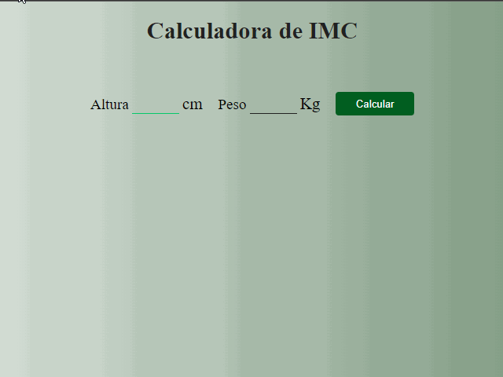

<div align="center" id="top"> 
  

&#xa0;

<a href="https://calculadora-imc.caciodev.com/">Demo</a>

</div>

<h1 align="center">Calculadora de IMC</h1>

<p align="center">
  

  

  
  
  


  <!--  -->

  <!--  -->

  <!--  -->
</p>

<!-- Status -->

<!-- <h4 align="center">
	🚧  Calculadora_de_imc 🚀 Em construção...  🚧
</h4>

<hr> -->

<p align="center">
  <a href="#dart-sobre">Sobre</a> &#xa0; | &#xa0; 
  <a href="#rocket-tecnologias">Tecnologias</a> &#xa0; | &#xa0;
  <a href="#white_check_mark-pré-requisitos">Pré requisitos</a> &#xa0; | &#xa0;
  <a href="#checkered_flag-começando">Começando</a> &#xa0; | &#xa0;
  <a href="#memo-licença">Licença</a> &#xa0; | &#xa0;
  <a href="https://github.com/kacyos" target="_blank">Autor</a>
</p>

<br>

## :dart: Sobre

Calculadora de IMC (Índice de Massa Corporal)

## :rocket: Tecnologias

As seguintes ferramentas foram usadas na construção do projeto:

- [HTML](https://developer.mozilla.org/pt-BR/docs/Web/HTML)
- [SCSS](https://sass-lang.com/)
- [JavaScript](https://developer.mozilla.org/pt-BR/docs/Web/javascript)

## :white_check_mark: Pré requisitos

Antes de começar :checkered_flag:, você precisa ter o [Git](https://git-scm.com) e o [Node](https://nodejs.org/en/) instalados em sua maquina.

## :checkered_flag: Começando

```bash
# Clone este repositório
$ git clone https://github.com/kacyos/calculadora_de_imc

# Entre na pasta
$ cd calculadora_de_imc

# Instale as dependências
$ yarn

# Para iniciar o projeto
$ yarn dev

# O app vai inicializar em <http://localhost:5173>
```

## :memo: Licença

Este projeto está sob licença MIT. Veja o arquivo [LICENSE](LICENSE.md) para mais detalhes.

Feito com :heart: por <a href="https://github.com/kacyos" target="_blank">Cacio de Castro</a>

&#xa0;

<a href="#top">Voltar para o topo</a>
